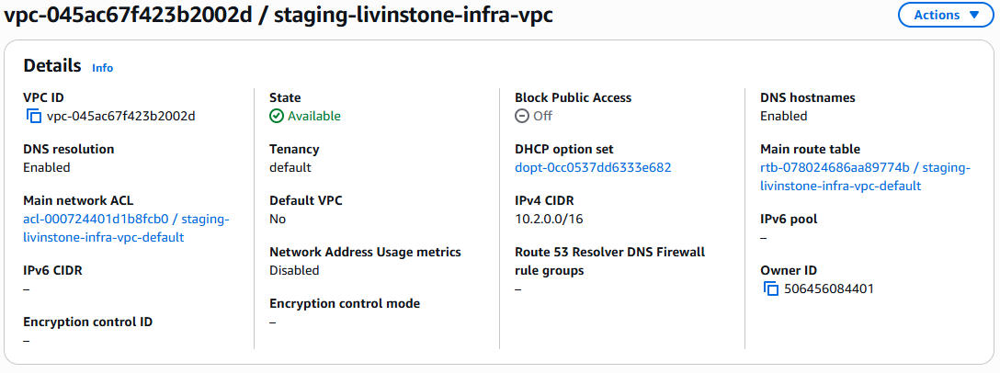
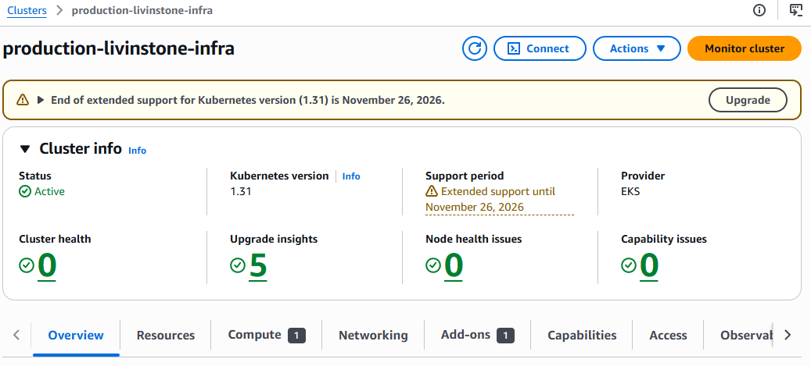
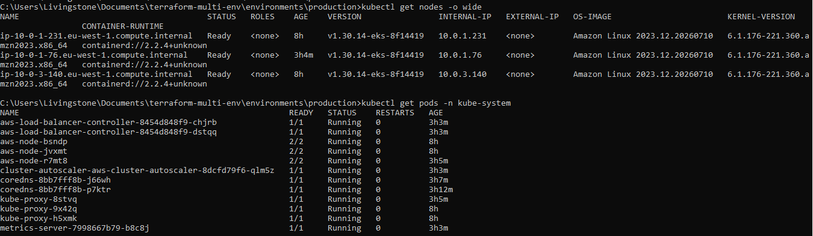

# EKS Terraform Foundation

Production-grade EKS cluster on AWS using reusable Terraform modules with separate state per environment.

Built in two parts that map directly to the blog post series:

- **Part 1 — Networking:** VPC, public/private subnets, NAT Gateways, route tables
- **Part 2 — EKS:** Cluster, system + application node groups, IRSA, LB Controller, Cluster Autoscaler, Metrics Server

## Structure

```
eks-terraform-foundation/
├── bootstrap/                    # Run once — creates S3 + DynamoDB for remote state
├── modules/
│   ├── networking/               # Part 1 — VPC, subnets, NAT gateways, route tables
│   ├── eks/                      # Part 2 — EKS cluster, OIDC, IRSA, managed add-ons
│   ├── node-groups/              # Part 2 — System (tainted) + application node groups
│   └── addons/                   # Part 2 — LB Controller, Cluster Autoscaler, Metrics Server
└── environments/
    ├── dev/                      # 2 AZs, t3.medium, min 1 node — for testing
    ├── staging/                  # 2 AZs, t3.medium, single NAT gateway — pre-production
    └── production/               # 3 AZs, t3.medium, 1-10 nodes via Cluster Autoscaler
```

## Before You Start

Update these two things before running anything:

1. **Project name** — in each `environments/*/variables.tf` and `bootstrap/variables.tf`, set your `project_name`
2. **Backend bucket** — in each `environments/*/main.tf`, replace `YOUR_PROJECT_NAME-tfstate-YOUR_ACCOUNT_ID` with the bucket name and account ID from the bootstrap output

## Prerequisites

- [Terraform](https://developer.hashicorp.com/terraform/install) >= 1.5
- [AWS CLI v2](https://docs.aws.amazon.com/cli/latest/userguide/getting-started-install.html) configured
- [kubectl](https://kubernetes.io/docs/tasks/tools/)
- [Helm 3](https://helm.sh/docs/intro/install/)

```bash
# Verify before starting
aws sts get-caller-identity
terraform --version
kubectl version --client
helm version
```

## Deployment

### Step 1 — Bootstrap (run once)

Creates the S3 bucket and DynamoDB table used for remote state across all environments.

```bash
cd bootstrap
terraform init
terraform apply
# Note the outputs: state_bucket and account_id
# Use these to update the backend config in each environment's main.tf
```

📸 *Screenshot: AWS Console → S3 showing the state bucket with versioning enabled*

### Step 2 — Deploy Dev

```bash
cd environments/dev
terraform init
terraform plan -out=dev.tfplan
terraform apply dev.tfplan
# Takes 15-20 minutes
```

Configure kubectl and grant access:

```bash
aws eks update-kubeconfig --name dev-YOUR_PROJECT_NAME --region eu-west-1

aws eks create-access-entry \
  --cluster-name dev-YOUR_PROJECT_NAME \
  --principal-arn arn:aws:iam::YOUR_ACCOUNT_ID:user/YOUR_IAM_USER \
  --region eu-west-1

aws eks associate-access-policy \
  --cluster-name dev-YOUR_PROJECT_NAME \
  --principal-arn arn:aws:iam::YOUR_ACCOUNT_ID:user/YOUR_IAM_USER \
  --policy-arn arn:aws:eks::aws:cluster-access-policy/AmazonEKSClusterAdminPolicy \
  --access-scope type=cluster \
  --region eu-west-1
```

Verify:

```bash
kubectl get nodes
kubectl get pods -n kube-system
```

Install add-ons (Helm uses your local kubeconfig):

```bash
terraform apply -auto-approve
```

### Step 3 — Deploy Staging

Staging uses a single NAT Gateway to stay within AWS EIP limits. Same steps as dev:

```bash
cd environments/staging
terraform init
terraform plan -out=staging.tfplan
terraform apply staging.tfplan

aws eks update-kubeconfig --name staging-YOUR_PROJECT_NAME --region eu-west-1
kubectl get nodes
kubectl get pods -n kube-system
terraform apply -auto-approve
```

### Step 4 — Deploy Production

Production spans 3 AZs with one NAT Gateway per AZ for full high availability.

```bash
cd environments/production
terraform init
terraform plan -out=prod.tfplan
terraform apply prod.tfplan

aws eks update-kubeconfig --name production-YOUR_PROJECT_NAME --region eu-west-1
kubectl get nodes
kubectl get pods -n kube-system
terraform apply -auto-approve
```



## Verify Everything is Healthy

Run this after each environment to confirm all add-ons are running:

```bash
kubectl get pods -n kube-system
# Expected:
# aws-load-balancer-controller   Running
# cluster-autoscaler             Running
# coredns                        Running
# kube-proxy                     Running
# metrics-server                 Running
# aws-node (VPC CNI)             Running
```

## Screenshots


*AWS Console → EKS → Clusters*


*All nodes Ready across availability zones*

## Blog Posts

- [Part 1 — Networking foundation](https://www.livinstone.dev/blog/terraform-multi-environment-iac)
- [Part 2 — EKS cluster deployment](https://www.livinstone.dev/blog/building-production-eks-cluster-from-scratch)
